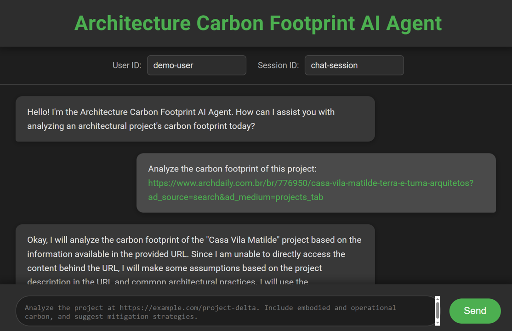

# 🧵 Strands Agents – Carbon Footprint API

This repository contains a **FastAPI application** powered by [Strands Agents](https://strandsagents.com/) for analyzing the **carbon footprint of architectural projects**.  

The agent integrates **Google Gemini** (via LiteLLM) with Strands’ session and conversation management to provide structured, actionable sustainability insights.  

The AI agent can:
- Extract project details (type, location, materials, energy systems, water/waste management, etc.)
- Estimate carbon footprint across lifecycle stages:
  - **Embodied carbon** (materials, transport, construction)  
  - **Operational carbon** (energy and water use during building life)  
  - **End-of-life carbon** (demolition, disposal, recycling potential)  
- Return structured outputs with:
  - Total estimated footprint (kgCO₂e / tCO₂e)  
  - Lifecycle breakdown  
  - Key emission drivers  
  - Suggested mitigation strategies (e.g., low-carbon concrete, passive design, renewables)  

The API exposes both **synchronous** and **streaming** endpoints for real-time interaction, making it suitable for integration into dashboards, design tools, or research workflows.

[▶️YouTube🔴 - Watch the demo](https://www.youtube.com/watch?v=jm0TCv11ZVQ)

[](https://www.youtube.com/watch?v=jm0TCv11ZVQ)


# Setup / Usage

1 - Create Virtual Environment `python -m venv .venv`

2 - Activate Virtual Environment `.venv\Scripts\Activate`

3 - Install requirements `pip install -r requirements.txt`

4 - Create a `.env` file with the proper api keys, example at `.env_example` [Generate Gemini API Keys Here](https://aistudio.google.com/app/api-keys)

5 - run `python app.py`

6 - open `localhost:8000` and interact with the agent to get streaming responses

7 - Open `localhost:8000/docs` to see the API Documentation 


## Query Examples

```
curl -X 'POST' \
  'http://localhost:8000/carbon' \
  -H 'accept: application/json' \
  -H 'Content-Type: application/json' \
  -d '{
  "prompt": "Analyze the carbon footprint of this project: https://www.archdaily.com.br/br/776950/casa-vila-matilde-terra-e-tuma-arquitetos"
  "user_id": "demo-user"
  "session_id": "chat-session"
}'

curl -X 'POST' \
  'http://localhost:8000/carbon-streaming' \
  -H 'accept: application/json' \
  -H 'Content-Type: application/json' \
  -d '{
  "prompt": "Analyze the carbon footprint of this project: https://www.archdaily.com.br/br/776950/casa-vila-matilde-terra-e-tuma-arquitetos"
  "user_id": "demo-user"
  "session_id": "chat-session"
}'
```

## Session Manager

Files get stored at the following path:
```
./sessions/
  └── user_id/
      └── session_<session_id>/
          ├── session.json                # Session metadata
          └── agents/
              └── agent_<agent_id>/
                  ├── agent.json          # Agent metadata and state
                  └── messages/
                      ├── message_<message_id>.json
                      └── message_<message_id>.json
```
There are other alternatives for session management, please check: [Session Management Documentation](https://strandsagents.com/latest/documentation/docs/user-guide/concepts/agents/session-management/#session-management)


## Project Roadmap

See the [TODO list](./TODO.md) for pending tasks and ideas


## Useful Sources
https://github.com/davidshtian/Learning-Strands-Agents/tree/hand
